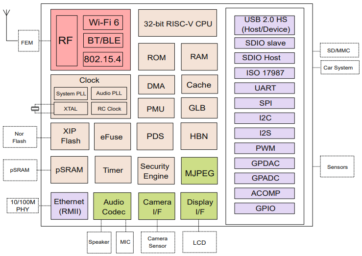

# [BL618](https://doc.soc.xin/BL618)

* [bouffalolab](https://www.bouffalolab.com/)：[RISC-V](https://doc.soc.xin/architecture/riscv)
* [L4R3](https://github.com/SoCXin/Level)：320MHz , [￥？](https://item.taobao.com/item.htm?id=697403593463)

## [简介](https://doc.soc.xin/BL618)

[BL618](https://dev.bouffalolab.com/document) 系列芯片采用 RISC-V 32-bit CPU，搭载 16KB D-cache 和 32KB I-Cache，CPU 主频高达 320MHz，适
用于物联网、嵌入式和人工智能等高性能应用领域。

片内集成 Wi-Fi 6/BLE/Zigbee 无线子系统，可以实现多种无线连接和数据传输，提供多样化的连接与传输体验。

### 关键特性

* 320 MHz RISC-V (带FPU和DSP)
* 480KB SRAM
* USB HS OTG
* Wi-Fi6 20/40MHz 1T1R 229.4 Mbps
* Zigbee/IEEE 802.15.4, Wi-Fi/BLE5.3/zigbee 共存

### [收录资源](https://github.com/SoCXin/BL618)

* [参考资源](src/)
* [参考文档](docs/)
* [参考工程](project/)

### [选型建议](https://github.com/SoCXin)

[BL618](https://github.com/SoCXin/BL618) 和 BL616的主要差异在封装，前者是QFN56，后者是QFN40

### [www.SoC.xin](http://www.SoC.Xin)
